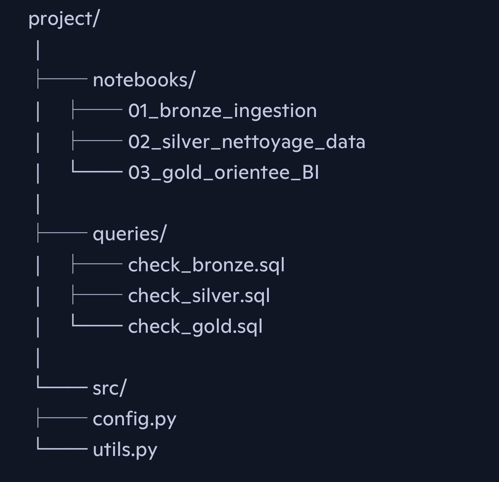

# 🎬 TMDB Movies – Pipeline Databricks (Bronze → Silver → Gold)

## 📌 Présentation

Ce projet met en place un pipeline complet d’ingestion, de transformation et de modélisation de données autour d’un dataset de 1 000 000 de films issus de **TMDb (The Movie Database)**.

Dataset utilisé :  
https://www.kaggle.com/datasets/asaniczka/tmdb-movies-dataset-2023-930k-movies

L’objectif est de construire un **modèle en étoile** exploitable par les métiers et optimisé pour la BI, en s’appuyant sur **Databricks**, **Delta Lake** et les bonnes pratiques Data Engineering.

---

## 🎯 Objectifs du projet

### 🔧 Objectifs techniques

- Construire un pipeline robuste **Bronze → Silver → Gold**

- Gérer un volume important de données

- Manipuler des structures complexes (listes, JSON, nested fields)

- Implémenter des **mises à jour incrémentales** (Delta MERGE)

- Assurer l’**historisation** via Delta Lake Time Travel

- Garantir une architecture stable, maintenable et extensible

### 📊 Objectifs analytiques

- Produire un **modèle en étoile** clair et performant

- Rendre les données directement exploitables par les outils BI

- Optimiser les tables pour les analyses métiers

### 📈 Objectifs décisionnels

Créer un dashboard permettant :

- d’analyser budget, revenus, rentabilité, popularité

- de suivre les tendances par genre, période, studio

- d’identifier les films les mieux notés

- de répondre rapidement aux questions métiers

---

## 🗂️ Structure du projet

 

  

---

## 🏗️ Architecture du pipeline

### 🥉 Bronze – Données brutes

**Base :** `01_bronze`  

**Table :** `tmdb_movies`

- Données brutes issues des CSV  

- Aucune transformation  

- Historisation complète  

- Données jamais modifiées  

---

### 🥈 Silver – Données nettoyées et normalisées

**Base :** `02_silver`  

**Tables :**

#### Dimensions intermédiaires

- `dim_film_genre`

- `dim_film_production_companie`

- `dim_film_production_country`

- `dim_film_spoken_language`

#### Tables Silver finales

- `silver_tmdb_movies`

- `silver_tmdb_movies_genre`

- `silver_tmdb_movies_production_companie`

- `silver_tmdb_movies_production_country`

- `silver_tmdb_movies_spoken_language`

**Objectifs :**

- Nettoyage, typage, normalisation  

- Gestion des structures complexes  

- MERGE incrémental  

- Préparation pour le modèle Gold  

---

### 🥇 Gold – Modèle en étoile orienté BI

**Base :** `03_gold`  

**Tables :**

#### Dimensions

- `dim_movies_compagnie_prod`

- `dim_movies_genre`

- `dim_movies_langage_traduit`

- `dim_movies_pays_prod`

#### Faits & relations

- `fact_movies`

- `rel_movies_compagnie_prod`

- `rel_movies_genre`

- `rel_movies_language_traduit`

- `rel_movies_pays_prod`

**Objectifs :**

- Tables orientées métier  

- Modèle en étoile performant  

- Optimisation pour Power BI / Tableau  

- Support des dashboards analytiques  

---

## 🧱 Synthèse du pipeline

| Couche | Contenu | Objectif |
|--------|---------|-----------|
| **Bronze** | Données brutes | Historisation complète |
| **Silver** | Données nettoyées, typées, normalisées | Source fiable et prête pour la modélisation |
| **Gold** | Modèle en étoile | Analyses BI & dashboards |

 

---

## 🚀 Technologies utilisées

- **Databricks** (notebooks, jobs, orchestration)

- **Delta Lake** (ACID, Time Travel, MERGE)

- **PySpark**

- **SQL**

- **Power BI / Tableau**

---

<!-- 
## 📌 Améliorations possibles

- Ajout d’un orchestrateur (Airflow, Databricks Workflows)

- Mise en place de tests automatisés (Great Expectations)

- Ajout d’un monitoring (Unity Catalog, Databricks Metrics)

- Intégration CI/CD (Repos + GitHub Actions)

*/
>
